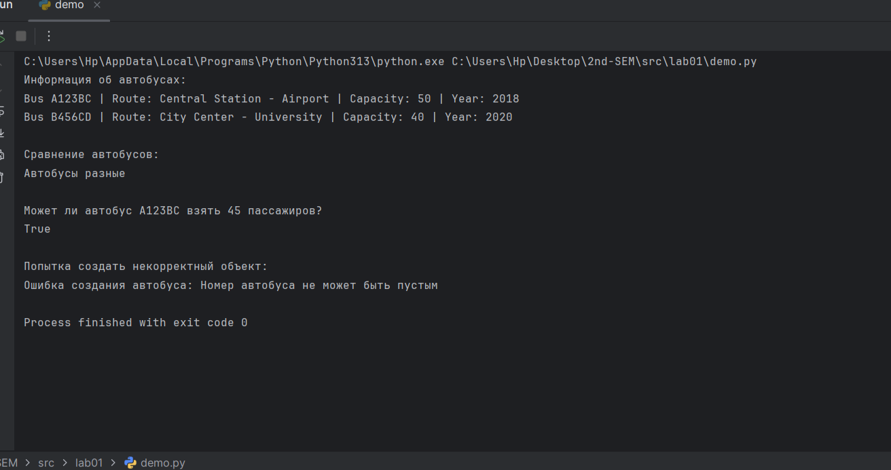
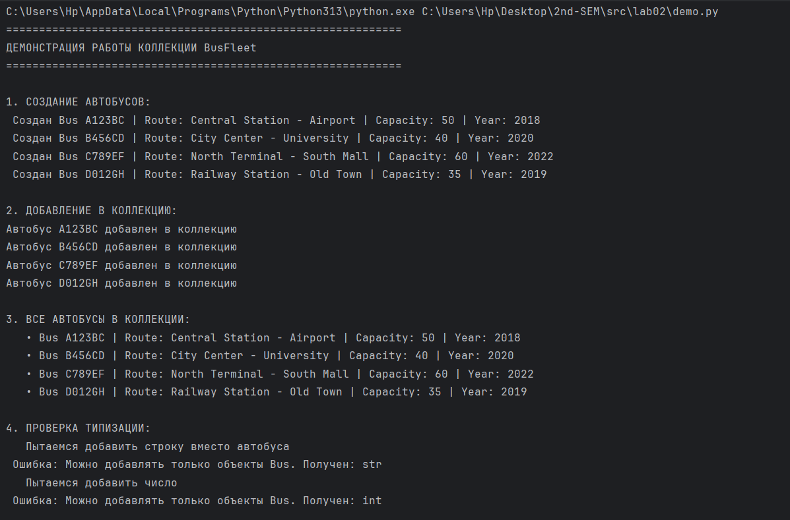
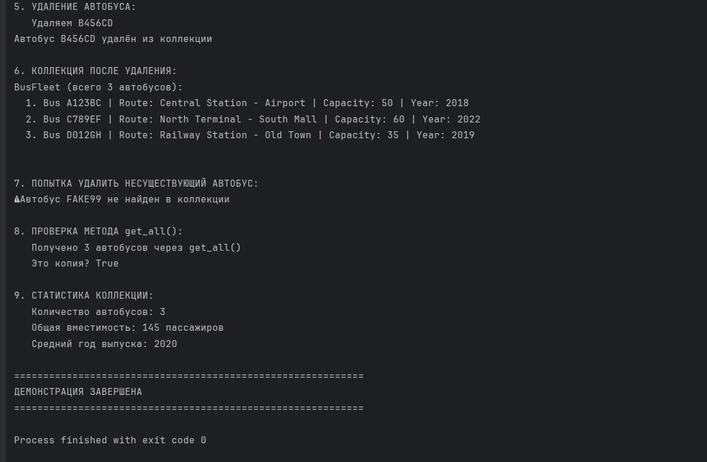

# ЛР-1 Класс и инкапсуляция
### Вариант №5 (Транспорт) 

## Возможности

- Создание автобусов с проверкой корректности данных
- Просмотр информации об автобусах (номер, маршрут, вместимость, год выпуска)
- Сравнение автобусов по номеру и маршруту
- Проверка возможности перевозки заданного количества пассажиров
- Обработка ошибок при создании некорректных объектов

## Класс Bus

### Атрибуты (свойства)

| Атрибут | Тип | Описание |
|---------|-----|----------|
| `number` | `str` | Государственный номер автобуса |
| `capacity` | `int` | Вместимость автобуса (количество мест) |
| `route` | `str` | Номер или название маршрута |
| `year` | `int` | Год выпуска автобуса |

### Методы

| Метод | Описание |
|-------|----------|
| `__str__()` | Возвращает строковое представление автобуса |
| `__eq__(other)` | Сравнивает два автобуса по номеру и маршруту |
| `can_take_passengers(passengers)` | Проверяет, может ли автобус вместить указанное количество пассажиров |

### Валидация данных

При создании автобуса выполняются следующие проверки:
- Номер автобуса не может быть пустым
- Вместимость должна быть больше 0
- Год выпуска должен быть не менее 1900

### Cоздание автобусов



# ЛР-2 Коллекция объектов (Python 3.x)
### Вариант №5 (Транспорт)

Класс BusFleet

## Методы коллекции:
| Метод	| Описание                         | Возвращаемое значение |
|---------|----------------------------------|----------|
| add(bus: Bus) | 	Добавить автобус в коллекцию    | None |
| remove(bus: Bus) | 	Удалить автобус из коллекции    |	bool |
| get_all() -> list | 	Получить список всех автобусов	 | list[Bus] |
| clear()	| Очистить коллекцию	              | None |
| __len__() -> int | 	Количество автобусов	           | int |
| __str__() -> str | 	Строковое представление	        | str |


## Вывод Demo.py




# Лабораторная работа №3 - Наследование классов

## Цель работы
- Освоить механизм наследования классов
- Научиться строить иерархию объектов
- Понять разницу между базовым и производным классами
- Научиться переиспользовать код
- Освоить переопределение методов

## Иерархия классов

    Bus (базовый класс)
    ├── ElectricBus (электроавтобус)
    └── DieselBus (дизельный автобус)

## Классы

### Базовый класс - Bus
Атрибуты:
- number (номер автобуса)
- capacity (вместимость)
- route (маршрут)
- year (год выпуска)

Методы:
- can_take_passengers() - проверка возможности взять пассажиров
- __str__() - строковое представление
- __eq__() - сравнение автобусов

### Производный класс - ElectricBus
Новые атрибуты:
- battery_capacity (емкость батареи в кВт·ч)
- charging_time (время зарядки в часах)

Новый метод:
- calculate_range() - расчет максимального пробега на одной зарядке

### Производный класс - DieselBus
Новые атрибуты:
- fuel_tank_capacity (объем топливного бака в литрах)
- fuel_consumption (расход топлива в л/100 км)

Новый метод:
- calculate_range() - расчет максимального пробега на полном баке


## Запуск demo.py


# Лабораторная работа №4 - Интерфейсы и абстрактные классы (ABC)

## Цель работы
- Познакомиться с абстрактными базовыми классами (ABC)
- Освоить понятие интерфейса (контракта поведения)
- Научиться задавать обязательные методы для классов
- Закрепить полиморфизм через единый интерфейс
- Научиться проектировать архитектуру, а не просто классы

## Иерархия классов

    Bus (базовый класс из ЛР-1)
    │
    ├── ElectricBus (электроавтобус)
    │ └── Реализует интерфейсы: Printable, Comparable, Chargeable
    │
    ├── DieselBus (дизельный автобус)
    │ └── Реализует интерфейсы: Printable, Comparable, Refuelable
    │
    └── SimpleBus (обычный автобус)
    └── Реализует интерфейс: Printable


## Интерфейсы (ABC)

### 1. Printable (печатный)
Абстрактные методы:
- `to_string() -> str` - возвращает полное строковое представление объекта
- `get_short_info() -> str` - возвращает краткую информацию

### 2. Comparable (сравнимый)
Абстрактные методы:
- `compare_to(other) -> int` - сравнивает текущий объект с другим
  - возвращает **отрицательное число**, если self < other
  - возвращает **0**, если self == other
  - возвращает **положительное число**, если self > other

### 3. Chargeable (заряжаемый)
Абстрактные методы:
- `charge(hours: float) -> str` - заряжает устройство указанное количество часов
- `get_battery_percentage() -> int` - возвращает текущий уровень заряда (0-100)

### 4. Refuelable (заправляемый)
Абстрактные методы:
- `refuel(liters: float) -> str` - заправляет топливом указанное количество литров
- `get_fuel_level() -> int` - возвращает текущий уровень топлива (0-100)

## Реализация интерфейсов в классах

| Класс | Printable | Comparable | Chargeable | Refuelable |
|-------|-----------|------------|------------|------------|
| **ElectricBus** | ✅ | ✅ | ✅ | ❌ |
| **DieselBus** | ✅ | ✅ | ❌ | ✅ |
| **SimpleBus** | ✅ | ❌ | ❌ | ❌ |

## Особенности реализации

### 1. Создание интерфейса (ABC)


Демонстрация (demo.py)

Программа демонстрирует:

    Создание объектов разных типов:

        2 электроавтобуса

        2 дизельных автобуса

        1 обычный автобус

    Использование интерфейса Printable:

        Функция print_all() работает с любыми объектами, реализующими Printable

        Разные классы имеют разную реализацию to_string() и get_short_info()

    Использование интерфейса Comparable:

        Сравнение электроавтобусов по емкости батареи

        Сравнение дизельных автобусов по расходу топлива

    Использование интерфейса Chargeable (только для ElectricBus):

        Зарядка батареи

        Отслеживание уровня заряда

    Использование интерфейса Refuelable (только для DieselBus):

        Заправка топливом

        Отслеживание уровня топлива

    Проверка через isinstance():

        Проверка, какие интерфейсы реализует каждый класс

    Полиморфизм через интерфейсы:

        Одна функция работает с разными типами объектов через общий интерфейс

### Скрины Demo.py:


# Лабораторная работа №5 - Функции как аргументы. Стратегии и делегаты

## Цель работы
- Освоить передачу функций как аргументов в другие функции и методы
- Научиться применять встроенные функции высшего порядка: map, filter, sorted
- Понять концепцию паттерна «Стратегия» и реализовать его на Python
- Освоить lambda-выражения и их практическое применение
- Интегрировать функциональный стиль с объектно-ориентированным кодом из предыдущих ЛР

## Структура проекта

    lab05/
    ├── base.py # Базовый класс Bus из ЛР-1
    ├── models.py # Классы ElectricBus и DieselBus из ЛР-3
    ├── collection.py # Класс BusFleet (коллекция) с методами sort_by, filter_by, apply, map
    ├── strategies.py # Функции-стратегии для сортировки, фильтрации, преобразования
    ├── demo.py # Демонстрация всех возможностей
    └── README.md


## Класс BusFleet (коллекция)

### Методы коллекции:

| Метод | Описание |
|-------|----------|
| `add(bus)` | Добавляет автобус в коллекцию |
| `sort_by(key_func)` | Сортирует коллекцию по функции-ключу (возвращает self) |
| `filter_by(predicate)` | Фильтрует коллекцию по предикату (возвращает self) |
| `apply(func)` | Применяет функцию к каждому элементу (возвращает self) |
| `map(transform)` | Преобразует коллекцию в список результатов |
| `get_all()` | Возвращает копию списка автобусов |

## Стратегии сортировки (strategies.py)

| Функция | Описание |
|---------|----------|
| `by_number(bus)` | По номеру автобуса |
| `by_capacity(bus)` | По вместимости |
| `by_year(bus)` | По году выпуска |
| `by_route(bus)` | По маршруту |
| `by_battery_capacity(bus)` | По емкости батареи (ElectricBus) |
| `by_fuel_efficiency(bus)` | По расходу топлива (DieselBus) |
| `by_combined(bus)` | По комбинации (год, вместимость, номер) |

## Функции-фильтры

| Функция | Описание |
|---------|----------|
| `is_electric(bus)` | Только электрические автобусы |
| `is_diesel(bus)` | Только дизельные автобусы |
| `is_modern(bus)` | Автобусы после 2020 года |
| `has_high_capacity(bus)` | Вместимость > 45 |
| `by_min_year(year)` | **Фабрика**: автобусы не старше года |
| `by_max_capacity(capacity)` | **Фабрика**: автобусы с вместимостью ≤ capacity |
| `by_route_contains(substring)` | **Фабрика**: маршрут содержит подстроку |

## Функции преобразования (для map)

| Функция | Описание |
|---------|----------|
| `to_short_string(bus)` | Преобразует в короткую строку |
| `to_dict(bus)` | Преобразует в словарь |
| `to_number(bus)` | Извлекает номер |
| `to_year(bus)` | Извлекает год |

### 1. Сортировка разными стратегиями

```python

# Через метод коллекции
fleet.sort_by(by_capacity)

# Через встроенную функцию sorted
sorted_buses = sorted(fleet.get_all(), key=by_year)

# Через lambda
sorted_buses = sorted(fleet.get_all(), key=lambda b: b.capacity)

```

### 2. Фильтрация

```python

# Через метод коллекции
fleet.filter_by(is_electric)

# Через встроенную функцию filter
electric = list(filter(is_electric, fleet.get_all()))

# Через lambda
modern = list(filter(lambda b: b.year > 2020, fleet.get_all()))

```

### 3. Преобразование через map

```python

# Получить все номера
numbers = fleet.map(to_number)

# Получить все годы через lambda
years = fleet.map(lambda b: b.year)

# Преобразовать в строки
strings = fleet.map(to_short_string)

```

### 4. Фабрика функций

```python

# Создаем фильтр для автобусов после 2022 года
filter_2022 = by_min_year(2022)
recent = [bus for bus in fleet.get_all() if filter_2022(bus)]

```

### Демонстрация Demo.py:

.png>)
.png>)
.png>)
.png>)
.png>)
.png>)
.png>)
.png>)

# Лабораторная работа №6 - Generics и typing

## Цель работы
- Освоить систему аннотаций типов в Python (typing)
- Научиться создавать обобщённые (generic) классы с помощью TypeVar и Generic
- Понять концепцию структурной типизации через typing.Protocol

## Иерархия классов
    Bus (базовый класс с аннотациями)
    ├── ElectricBus (с аннотациями)
    └── DieselBus (с аннотациями)


## Аннотации типов в классах

### Базовый класс Bus

```python
class Bus:
    def __init__(self, number: str, capacity: int, route: str, year: int) -> None:
        self._number: str = number
        self._capacity: int = capacity
        self._route: str = route
        self._year: int = year
    
    @property
    def number(self) -> str:
        return self._number
    
    def can_take_passengers(self, passengers: int) -> bool:
        return passengers <= self._capacity

```

### Generic-коллекция (container.py)

```python

from typing import TypeVar, Generic, List, Callable

T = TypeVar('T')

class TypedCollection(Generic[T]):
    def __init__(self) -> None:
        self._items: list[T] = []

    def add(self, item: T) -> None:
        self._items.append(item)

    def get_all(self) -> list[T]:
        return self._items.copy()
    
    def sort_by(self, key_func: Callable[[T], any]) -> 'TypedCollection[T]':
        self._items.sort(key=key_func)
        return self
    
    def filter_by(self, predicate: Callable[[T], bool]) -> 'TypedCollection[T]':
        self._items = [item for item in self._items if predicate(item)]
        return self
    
    def __len__(self) -> int:
        return len(self._items)

```

### Demo.py
.png>)
.png>)
.png>)
.png>)
.png>)
.png>)

# Лабораторная работа №7 - Консольное приложение

## Цель работы
- Объединить все знания, полученные в ЛР1–ЛР6, в единое работающее приложение
- Реализовать интерактивный CLI-интерфейс с меню и вводом пользователя

## Функциональность


### Возможности

1. **Добавление автобуса**
   - Обычный автобус (номер, вместимость, маршрут, год)
   - Электрический автобус (+ емкость батареи, время зарядки)
   - Дизельный автобус (+ объем бака, расход топлива)

2. **Просмотр всех автобусов**
   - Детальная информация о каждом автобусе

3. **Поиск автобуса**
   - По номеру (точное совпадение)
   - По маршруту (частичное совпадение)

4. **Удаление автобуса**
   - С подтверждением перед удалением

5. **Статистика**
   - Количество автобусов по типам
   - Средняя вместимость
   - Самый старый и новый автобусы

6. **Сохранение данных**
   - Автоматическое сохранение при выходе
   - Ручное сохранение через меню

## Обработка ошибок

Приложение корректно обрабатывает:
- Неверный пункт меню
- Ввод строки вместо числа
- Пустые поля ввода
- Некорректные значения (отрицательные, слишком большие)
- Дубликаты номеров автобусов
- Поиск/удаление несуществующих автобусов


### Демонстрация:1
.png>)
.png>)
.png>)