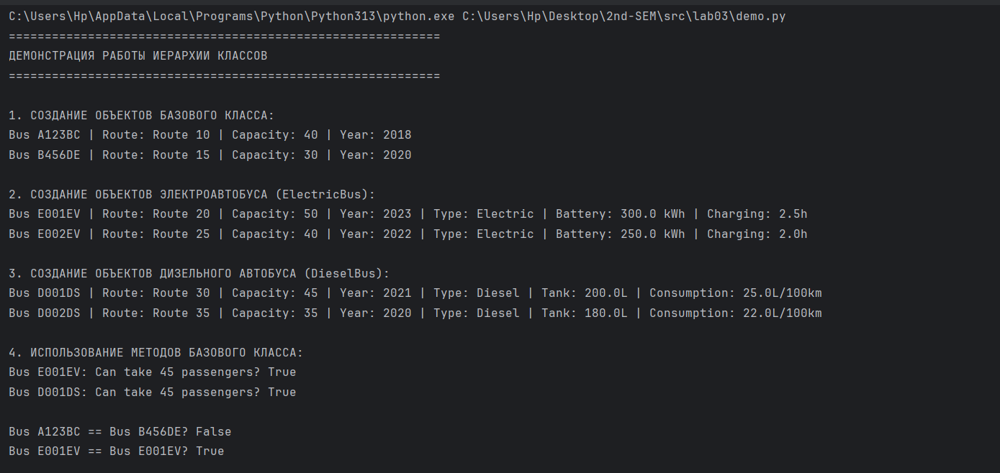
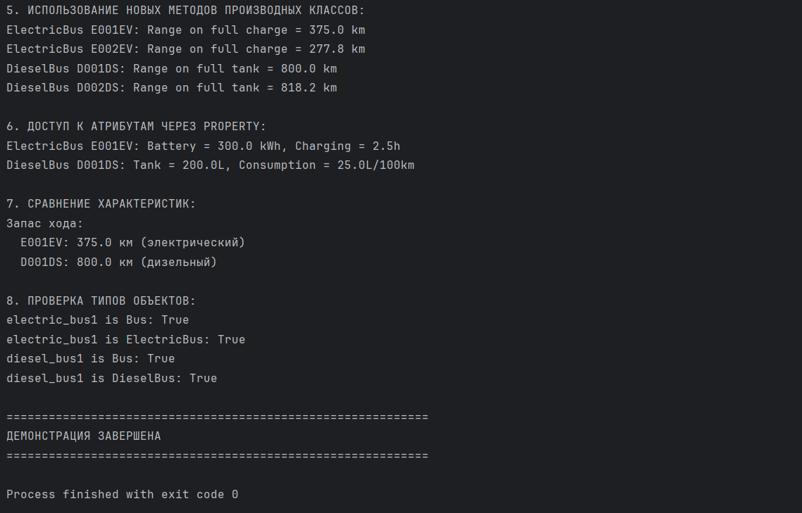

# Лабораторная работа №3 - Наследование классов

## Цель работы
- Освоить механизм наследования классов
- Научиться строить иерархию объектов
- Понять разницу между базовым и производным классами
- Научиться переиспользовать код
- Освоить переопределение методов

## Иерархия классов

    Bus (базовый класс)
    ├── ElectricBus (электроавтобус)
    └── DieselBus (дизельный автобус)

## Классы

### Базовый класс - Bus
Атрибуты:
- number (номер автобуса)
- capacity (вместимость)
- route (маршрут)
- year (год выпуска)

Методы:
- can_take_passengers() - проверка возможности взять пассажиров
- __str__() - строковое представление
- __eq__() - сравнение автобусов

### Производный класс - ElectricBus
Новые атрибуты:
- battery_capacity (емкость батареи в кВт·ч)
- charging_time (время зарядки в часах)

Новый метод:
- calculate_range() - расчет максимального пробега на одной зарядке

### Производный класс - DieselBus
Новые атрибуты:
- fuel_tank_capacity (объем топливного бака в литрах)
- fuel_consumption (расход топлива в л/100 км)

Новый метод:
- calculate_range() - расчет максимального пробега на полном баке

## Запуск demo.py

