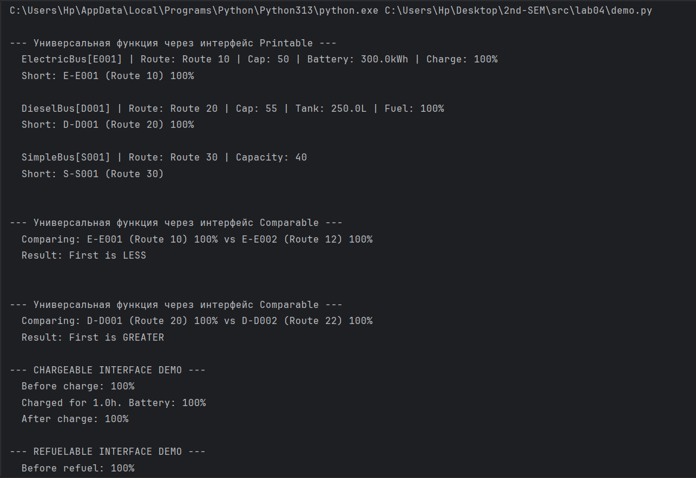
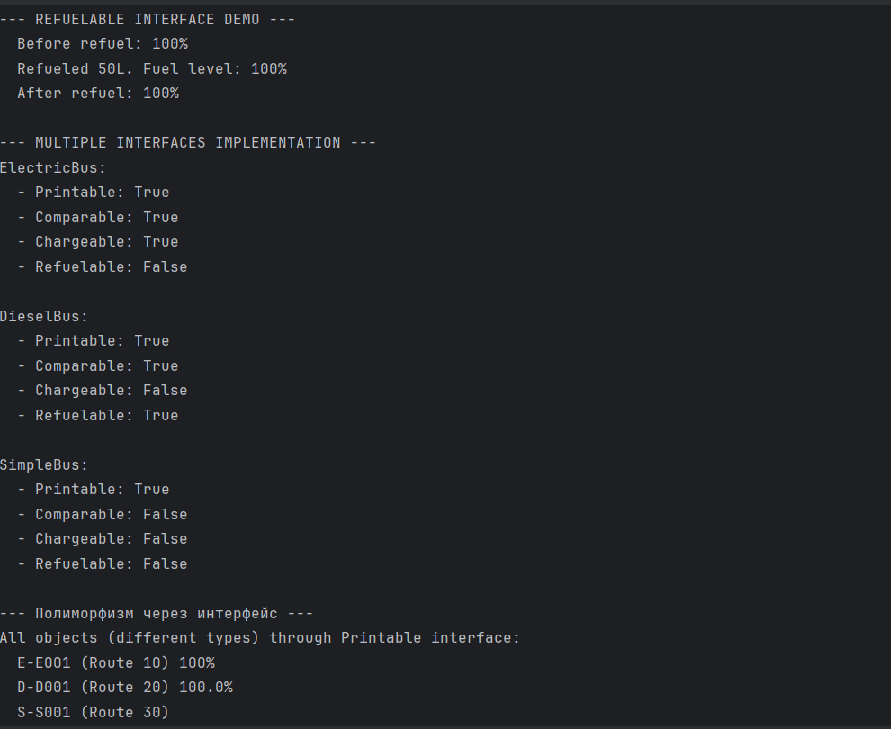

# Лабораторная работа №4 - Интерфейсы и абстрактные классы (ABC)

## Цель работы
- Познакомиться с абстрактными базовыми классами (ABC)
- Освоить понятие интерфейса (контракта поведения)
- Научиться задавать обязательные методы для классов
- Закрепить полиморфизм через единый интерфейс
- Научиться проектировать архитектуру, а не просто классы

## Иерархия классов

    Bus (базовый класс из ЛР-1)
    │
    ├── ElectricBus (электроавтобус)
    │ └── Реализует интерфейсы: Printable, Comparable, Chargeable
    │
    ├── DieselBus (дизельный автобус)
    │ └── Реализует интерфейсы: Printable, Comparable, Refuelable
    │
    └── SimpleBus (обычный автобус)
    └── Реализует интерфейс: Printable

## Интерфейсы (ABC)

### 1. Printable (печатный)
Абстрактные методы:
- `to_string() -> str` - возвращает полное строковое представление объекта
- `get_short_info() -> str` - возвращает краткую информацию

### 2. Comparable (сравнимый)
Абстрактные методы:
- `compare_to(other) -> int` - сравнивает текущий объект с другим
  - возвращает **отрицательное число**, если self < other
  - возвращает **0**, если self == other
  - возвращает **положительное число**, если self > other

### 3. Chargeable (заряжаемый)
Абстрактные методы:
- `charge(hours: float) -> str` - заряжает устройство указанное количество часов
- `get_battery_percentage() -> int` - возвращает текущий уровень заряда (0-100)

### 4. Refuelable (заправляемый)
Абстрактные методы:
- `refuel(liters: float) -> str` - заправляет топливом указанное количество литров
- `get_fuel_level() -> int` - возвращает текущий уровень топлива (0-100)

## Реализация интерфейсов в классах

| Класс | Printable | Comparable | Chargeable | Refuelable |
|-------|-----------|------------|------------|------------|
| **ElectricBus** | ✅ | ✅ | ✅ | ❌ |
| **DieselBus** | ✅ | ✅ | ❌ | ✅ |
| **SimpleBus** | ✅ | ❌ | ❌ | ❌ |

## Особенности реализации

### 1. Создание интерфейса (ABC)

Демонстрация (demo.py)

Программа демонстрирует:

    Создание объектов разных типов:

        2 электроавтобуса

        2 дизельных автобуса

        1 обычный автобус

    Использование интерфейса Printable:

        Функция print_all() работает с любыми объектами, реализующими Printable

        Разные классы имеют разную реализацию to_string() и get_short_info()

    Использование интерфейса Comparable:

        Сравнение электроавтобусов по емкости батареи

        Сравнение дизельных автобусов по расходу топлива

    Использование интерфейса Chargeable (только для ElectricBus):

        Зарядка батареи

        Отслеживание уровня заряда

    Использование интерфейса Refuelable (только для DieselBus):

        Заправка топливом

        Отслеживание уровня топлива

    Проверка через isinstance():

        Проверка, какие интерфейсы реализует каждый класс

    Полиморфизм через интерфейсы:

        Одна функция работает с разными типами объектов через общий интерфейс

### Скрины Demo.py:

